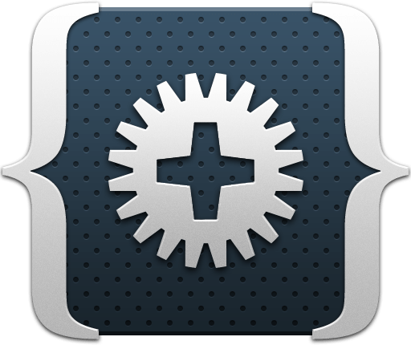

# 10 Years as a Full Time Webdeveloper

A reflection for myself, published for all with too much time to read about my journey.

The 2nd May 2022 marks my 10 years anniversary as a Webdeveloper.
Then years ago, I had my first work day at [MASSIVE ART Webservices](https://www.massiveart.com/).

I was a bloody Trainee had nearly no knowledge about the Web. My
only contact with web development was a [Dreamweaver](https://en.wikipedia.org/wiki/Adobe_Dreamweaver) book my brother had,
some simple HTML/CSS in school focused on using [frames](https://developer.mozilla.org/en-US/docs/Web/HTML/Element/frame)
(I'm not talking about iframes here 😉), 
and a part of my school thesis which was written in PHP, which was my
first contact with PHP. That project contains really ugly self created
management UI for Microsoft Exchange user, communicating over [SOAP](https://en.wikipedia.org/wiki/SOAP) [WSDL](https://en.wikipedia.org/wiki/Web_Services_Description_Language)
API with a .NET application. It was a lot of a mix between HTML and
application logic. It was hosted using Xampp on a Windows Server and
think was not running a long time on that one.

My first contact with a programming language was some years before.
I did go to the [HTL Dornbirn](https://www.htldornbirn.at/) which had
a how I would had said it as a 14 year old then "a school branch focused
on computers". At that time the first 2 years we didn't got into any
contact with programming languages, only some logic programs with [Kara](https://de.wikipedia.org/wiki/Kara_(Programmierumgebung)) and HTML.
We started in the third year with C++. I think not the best language
to start with, I remember I had hard time to get my head around [pointers](https://en.wikipedia.org/wiki/Pointer_(computer_programming))
and [linked lists](https://en.wikipedia.org/wiki/Linked_list).
Good that we had a year later continued with [Java](https://en.wikipedia.org/wiki/Java_(programming_language)),
which I think is still a great language to teach [object orientated programming](https://en.wikipedia.org/wiki/Object-oriented_programming)
and a lot of design patterns, which I think the teacher did a great job
focusing on this kind of things. We also learned the different sort 
algorithm which I not longer remember because I never had a need
for them. At least they tell us there are always different ways to
a solution and there is not always wrong or right. At the time at school
I was also a passionated Gamer, playing [Battlefield 2](https://en.wikipedia.org/wiki/Battlefield_2)
a lot. Found out that the game could be easily modded and created my
own maps and got very interested in kind of creating 3d models. The game
used [Python](https://en.wikipedia.org/wiki/Python_(programming_language))
as script language, a language I never learned and just copied
some snippets together. Funfact I'm still not able to create at this time
a ["Hello World"](https://en.wikipedia.org/wiki/%22Hello,_World!%22_program)
in Python, as I never got into any contact with that programming language again.
At that time I was very interested in Game Development and was experimenting
with [OGRE 3D](https://de.wikipedia.org/wiki/OGRE) an open source cross platform
Graphic Engine. Got a lot of fun when we did got tasks to create a 2D tank battle
game with [Allegro](https://liballeg.org/) in the school.

After the school and a summer of doing nothing as a 19 years old, I had to do
my conscription, which I lucky could serve as radio operator, trying out the
range of the new radio devices they got and drinking beer with my new friend,
which I still meet from time to time again to talk about the old time and drink
some beers.

After the conscription it was time to find a job. I did not find that I could
survive as a typical software developer doing Java, C# or even could compete with
my colleagues which already did Internship in that companies. Also I could
not see myself in a big company with many people, I prefer to know all people
I work together with and not wanted to be just another employee.
After some search I did stumble over Webdeveloper job advertisement from
[MASSIVE ART Webservices](https://www.massiveart.com/). I thought I know a
little PHP, thought HTML/CSS is elegant way to create UIs and the Web
could not be so hard at the end, so something I could maybe survive and not
fail totally. So send my application documents, which I later found out was I think
the baddest worst they received, still got a Job Interview and got a chance
to start as Trainee Webdeveloper at 2nd May 2012. At this time (2022) it is
was still the only time I send application documents to a company and so the
only time I had ever a Job Interview with somebody. I didn't search for any
alternative.

## The beginning

I started with another Trainee, the surely very talented and one of the funniest 
person I ever met, the legendary [3rfan](https://twitter.com/3rfan). Always
a joke on its lips and sure a very passionate developer, which I tried to keep up with.

The Agency (MASSIVE ART) had its own [CMS](https://en.wikipedia.org/wiki/Content_management_system),
which was named ZOOLU.

The ZOOLU CMS was based on the [Zend Framework 1](https://framework.zend.com/manual/1.12/de/manual.html).
It was the time before [composer](https://getcomposer.org/) did solve all our dependency problems.

It was also the time CSS / HTML was not so complicated like today. And CSS
was simply minified over a special endpoint by the CMS, so it was not part
of the frontend developers Job. But the web always was a fast developing 
business. The first precompile software I did got into contact with was
[Codekit](https://codekitapp.com/).

    

Which we did use to compile [LESS](https://lesscss.org/) into CSS. 
At my early time at MASSIVE ART, it was the switch from 
[prototype.js](http://prototypejs.org/) to the newcomer [jQuery](https://jquery.com/).
The jQuery library did grow fast and was the library which was now nearly used to
develop every new website and I think it did tell us a lot what was
missing in the standard library of JavaScript. Today most things 
which were solved at that time via jQuery are now supported natively 
in any browser. At the beginning it was also the end time of [IE6](https://en.wikipedia.org/wiki/Internet_Explorer_6),
all were happy as it was told we not longer need to test on IE6. Beside
the other browsers IE6 did use another box model and did make the things
a lot harder. I also did got into contact with strange `.htc` files which
fixes as example transparency in PNG on IE6, and in some cases used
DirectX filters to fix other compatibility issues. It was also the time
of CSS3Pie and a lot of Modernizr checks for compatibility. Why we did
got this type of issues I think the frontend development did not got
easier, it is even harder with getting into it with all this package managers
and build tools around today.
Over the years at MASSIVE ART we did switch through a lot of build tools
over the time. After Codekit there was [Grunt](https://gruntjs.com), then there was
[Gulp](https://gulpjs.com/), I think there was even one project with [yeoman](https://yeoman.io/),
we then used [browserify](https://browserify.org/) and ended up with [webpack](https://webpack.js.org/).
And beside npm at that time was node only, it was used [bower](https://bower.io/) 
to manage the frontend dependencies, before [npm](https://www.npmjs.com/)
and then later [yarn](https://yarnpkg.com/) was used. I still think
PHP created the only great dependency manager, how it works with git repositories
and how easy it is to create and include forks. The JS ecosystem is today
a real mess as they can not decide for a dependency manager there are 
a lot beside `npm`, there is `yarn`, but also `yarn@2` and `yarn@3` which
are different, today there is also `pnpm` and it would not take long
we will hear about a new one.
Why I did program CSS without following a specific paradigm, best match was
maybe [SMACSS](http://smacss.com/) without knowing it actually.
I did stumble some time ago over [ITCSS](https://www.xfive.co/blog/itcss-scalable-maintainable-css-architecture/)
from [Harry Roberts](https://csswizardry.com/), which I did later mix with BEM and Objects from
["Rethinking Design Practices"](https://www.youtube.com/watch?v=xxbc3wAztl0) from [Mark Dalgleish](https://twitter.com/markdalgleish). I finally got a way
of writing CSS which did feel good for me.
Read more about [here](https://github.com/alexander-schranz/itcss).
But the most important rule I learned over the years in CSS is a component
should never define the space outside of it. That way you avoid a lot of side
effects and responsibility of spacing is part of the parent component, which
make the things a lot easier to place.
But back to the past, better said back to the year 2013.

## Technology changes

In the year 2013 so after 1 year I worked at MASSIVE ART they decided to
rewrite the CMS from stretch on a modern new technology stack. In the
end of summer 2013 the first lines of the new Content Management System
named "Sulu" was written. It was decided to switch from the Zend Framework
to [Symfony](https://symfony.com/) (at that time Symfony 2.6). The frontend
stack of the was created with [Backbone.js](https://backbonejs.org/) and 
[Aura](https://github.com/aurajs/aura). I was not involved a lot in that
part as at that state I was working in another team. Still I did wrote many
parts of the MediaBundle, which crimes I did write there are still there today
(God help us, we should rewrite that part soon!).

Why Symfony was mostly the best decision we did make, the decision to build
on [aura js](https://github.com/aurajs/aura) wasn't. So if you never
heard about it, it is because it died before ever reaching a 1.0 version.
Still it was used and is still used in Sulu 1.x and does its job.

## A promising project

At the time the so new "Sulu Team" was building the companies next CMS and
I got into a new project called [stickermanager.com](https://www.stickermanager.com).
It is an exchange platform for panini football stickers and other stickers.

The technology stack was very interesting, I did first got into contact
with [Websockets](https://developer.mozilla.org/en-US/docs/Web/API/WebSockets_API),
and even did write my first lines of code in [GoLang](https://go.dev/).
We used the [Beego](https://beego.vip/) framework to provide APIs
which could called by PHP which will forward data to the client via
there Websocket connection to the Go Server. If we would today do the project,
we even would not have to implement that concept ourselves in GoLang,
instead we would just use the [Mercure](https://mercure.rocks/) for this
which uses similar concepts. The frontend stack was not less interesting,
it was our first project with [React](https://reactjs.org/), we decided at
that time go with a flux state management library called [alt js](http://alt.js.org/).
In this project we also had the first time to deal with millions of data
and compare them to each other.

Beside another colleague, I did work here together with [Thomas Schedler](https://twitter.com/chirimoya)
which did have the lead in this project. He was at that time the Software Architect and Team Leader of Sulu CMS.
I remember he did a lot of research about how to deal with the data, even
tried using [Elasticsearch](https://de.wikipedia.org/wiki/Elasticsearch),
because of our near connection to [crate.io](https://crate.io).
At the end the solution which still runs, is simple bitmask operation on MySQL
level which was the most performant way.

Why the project wasn't easy, with a lot of different challenges, it marks also
a milestone in my career. Beside that I learned a lot in that project, it also
defines the time were I got my foot into the door of the [Sulu](https://sulu.io/)
Team.

The project still is only and runs, I also think the designer [Philipp Gabl](https://twitter.com/philippgabl)
did do a great job on the project then still after 8 years it looks great and
modern, from my point of view.

In the browsers dev tools console still some easter egg can be found. A hint to list
the team members which created the project. I think on of the only easter eggs
I ever added to a project. I think we should do this kind of things more often, to
make development more fun:

## Getting more into open source

On our first hackday specially for Sulu and the [Symfony CMF](https://github.com/symfony-cmf),
I decided to bring another feature which we did had in our old ZOOLU CMS to the
Sulu ecosystem. It was the first version of the [SuluFormBundle](https://github.com/alexander-schranz/sulu-form-bundle)
which was later moved from my personal Github Namespace to the official [Sulu
Namespace](https://github.com/sulu/SuluFormBundle). It was even some discussion
if it should stay open source or not, but it did and now it is still there.

The next big project after Stickermanager which I was involved with the Sulu Team
were projects for a german publisher of magazines. In this project we created the
[SuluArticleBundle](https://github.com/sulu/SuluArticleBundle/) mostly created by
our Elasticsearch Hero and loud laughing colleague [Johannes](https://twitter.com/WachterJohannes/).
The projects requirements with the need of thousands of articles the decision was
made to use Elasticsearch here as additional view layer, because PHPCR was not the
best storage for this amount of data. As the client was very welcome to open
source the SuluArticleBundle could be open sourced and also used for free by others.

Why we are creating currently an Elasticsearch free version of the Article Bundle
the history of the Article Bundle should be known before judge the requirements here.

We created for the same client a new version of one of their websites called
[kuechengoetter.de](https://www.kuechengoetter.de/). Which did also bring the next
Bundle to the Sulu Ecosystem, the [SuluCommunityBundle](https://github.com/sulu/SuluCommunityBundle).
Which I did also work on. Why it is not longer used on that website, we still work
with this client and improve this and other websites for them. So more and more
I did not only work on client projects but could also to work to improve our
open source projects and ecosystem.

## Wallpaper change

The year 2018 marks another milestone, the Sulu team was not longer a team inside
the MASSIVE ART Agency. With the begin of October 2018 my official employer switch
on my papers from MASSIVE ART to the new created ["Sulu GmbH"](https://sulu.io/).

It was a new journey, be part again of a small company, trying to stand on its
own feeds.
One of the reasons why I did start working at MASSIVE ART was that liked the small
company feeling. And with Sulu we were again in that small company feeling.
We even got our own office, it was just 3 houses beside MASSIVE ART
but got us into this startup like feeling. Which I must say I still miss some days this Office.

## Open Source and Conferences

In October - November 2018 it was the first time I did got into contact with [Redis](https://redis.io)
I mean not using redis as a key value cache for saving caches or sessions over
some abstraction. Really work with Redis and what it can do. It is really a Swiss Army Knife,
with Redis 5 they added a new data type ["Streams"](https://redis.io/docs/manual/data-types/streams/)
this new data type allowed to use messages like system over Redis. At that case
the [symfony/messenger](https://symfony.com/doc/current/messenger.html) component was
very new and in an experimental state. We decided to implement our own transport which
did instead of the current supported amqp use redis streams to transport messages. 
We open sourced it under [handcraftedinthealps/RedisTransportBundle](https://github.com/handcraftedinthealps/RedisTransportBundle).

The december 2018 marks my first visit on a "real" conference. Before I was just
on some local meetups or local conferences. It was the year of the [Symfony Con in Lisbon](https://sulu.io/blog/visiting-lisbon-for-symfonycon-2018).
I which did never travel a lot to other cities it was a great journey to travel
to this big city, listen to great talks, drink some beers with other developers
and have a hackday with people you just know before from Github profile picture.

At that state I did already do some small pull requests to [Symfony framework](https://github.com/symfony/symfony)
which we used in our [Sulu CMS](https://github.com/sulu/sulu). But I never thought
about what did land in my inbox in 2019. An invitation from the Symfony Team
to the [EU FOSSA Hackathon in Brussel](https://sulu.io/blog/the-1st-eu-fossa-symfony-hackathon).
The hackathon was sponsored by the EU Commission and a small group of contributes and
core team member were invited to Brussel to hack on Symfony and its Ecosystem
together. So in April 2019 I was able to attend a hackathon with a lot of great 
people and open source heros. Traveling to Brussel with some great developers from
the well known switzerland company [Liip](https://www.liip.ch).
I was able to work there to bring the Redis Transport
we created already as own bundle into the Symfony Core. And with a lot of support,
specially thanks here to [Tobias Nyholm](https://twitter.com/TobiasNyholm) who always 
had an open ear for me, I was able to finish that task. With the split in Symfony 6
into an own symfony package I can even see on the [packagist site of symfony/redis-messenger](https://packagist.org/packages/symfony/redis-messenger/stats#major/6)
site that even the last 30 days about ~800000 installation of that package were made 
and its usage is growing. Still a lot of other great developers improved it,
but I'm happy I could made such a contribution to the Symfony Ecosystem
and so made the fundamental with a lot of help of others for all future usages of
Redis Streams in the Symfony Ecosystem.

    

Beside my own steps into open source community of Symfony. It was also great to see
the Sulu Community growing. Helping other developers using Sulu in our [Slack channel](https://sulu.io/services/support#chat)
was always a pleasure for me. It was also great over the years see a lot of other
developers which were not part of the core team trying to help others there. I was
always strict about the usage of Slack `Thread` feature in our slack channel. This
way I think we got a good community together and make sure also if it take some
times that almost every question will be answered.

## New Major

A year before in 2017 it was also another big change for Sulu. A new major version was
planned. As the frontend libraries with `Backbone.js` and `Aura` was not state of the
art, the new major version was focus on rewriting the whole frontend code of Sulu
CMS. The frontend rewrite was lead by the great [danrot](https://twitter.com/danrot90).
It was completely rewritten on a new stack with [React](https://reactjs.org/) and [Mobx](https://mobx.js.org),
a stack which we are still happy with it 4 years later. I personally had not todo
much with the rewrite of the frontend, but could work on some small improvements
for the backend code. Over the years then I focus to keep Sulu and its ecosystem
always up to date with the current PHP and Symfony versions. That means not only
working on the Sulu core but also keep dependencies of Sulu up to date and working
with the latest versions. The 2.0 version of Sulu was finally released at 2nd October 2019,
with a new fresh UI.

## Certification

In 2018 a got another opportunity, with a group of developers from MASSIVE ART I 
was able to attend courses for preparation for the Symfony 4 Certification. [Andreas Hucks](https://twitter.com/meandmymonkey)
from Sensio Labs Germany (today QOSSMIC) did in the courses teach as all about
what he knows about PHP, HTTP Protocol, Symfony and Symfony Components / Framework.

In this case I can recommend for every Web Developer to read once the
[HTTP Protocol Specification](https://datatracker.ietf.org/doc/html/rfc2616). It
is not as long as somebody think, but it contains the fundamental basics
what we are doing every day. The courses ends, end we had still possible attend
preparing tests over the sensio labs university one month. Still I could not
get over my exam anxiety and did not give the real test a try.

More than 1 and a half year later (12. June 2020) I got some motivation, bought myself
a coupon code to do the certification. The motivation was from short time and
it took me another year, shortly before the coupon expires (basically on the last minute)
to attend the test.

I was happy as after not giving it a try for about 2,5 year I could remove it
from my list at 12. June 2021. I even got to rank myself as a [Symfony 5 Expert](https://connect.symfony.com/badge/151/symfony-5-certified-developer-expert).
Still the best part was to finally had done it.

## Publishing my first article

The last year I did try to create some blog posts,
mostly just to experiment with different things and free my mind of the ideas going around
in my head. I'm using Github as a platform for it. So I can provide also directly
working code examples with my blog post. All blogs can be found here under [https://github.com/topics/alexander-schranz-article](https://github.com/topics/alexander-schranz-article).
In September 2021 I got out of the nowhere the opportunity to write a real article for the
german PHP Magazine from [Entwickler.de](https://entwickler.de/). After some discussion
I decided to write an article about the new [Symfony Runtime](https://symfony.com/doc/current/components/runtime.html) Component in combination
with the [PHP Runtime](https://github.com/php-runtime/runtime) Project. Where I did use [roadrunner](https://roadrunner.dev/), [swoole](https://openswoole.com/)
and other alternative possibilities to run PHP applications. The full article is available on their website,
under the great title [The future is now!](https://entwickler.de/php/the-future-is-now).

## Summary

Ten years did go faster than I ever thought. Web development did change a lot,
I would not be sure if something like [Tailwind CSS](https://tailwindcss.com/)
would be accepted 10 years ago. While sending HTML over ajax request where 
normally 10 years ago, then was bad practices and were replaced with json
APIs, HTML over ajax is now coming back with [Turbo](https://turbo.hotwired.dev/).
Something like [React](https://reactjs.org/) did stay longer then I ever thought
and hopefully will be continued this way.
JavaScript did make a big shift in the last 10 years first from function pattern
like [Revealing Pattern](https://medium.com/@Rahulx1/revealing-module-pattern-tips-e3442d4e352) 
which I did prefer, to then classes and now back to functions but into
complete direction of functional programming.
What I definitely learned there are a lot of different paradigm, think the best
example you currently see in the PHP Community with Symfony vs. Laravel. They
have totally different paradigm, where I definitely on the Symfony side here
because Laravel is too much magic/shortcuts for me, I don't think that Laravel
is a bad Framework. I think always people should use what they are most familiar
with and what they have fun to work with. That is also something we follow with Sulu CMS,
that we want to give 100% freedom how somebody create there website with Sulu
and is not force to a specific JS or frontend library.

## What is coming next

At work we are currently preparing the next release for Sulu, which I'm
currently working on bringing [Symfony 6 support](https://github.com/sulu/sulu/issues/6556)
to our core. The [milestone for 2.5](https://github.com/sulu/sulu/milestone/25) also looks promising we are working
on bringing 2FA to the Admin, Password Policy and Copy Block functionality.
As mention above I did the last year write some blogs.
There is currently one blog which is still work in progress the Hexagonal Architecture Study
or how I did call it [Project Rabbit Hole](https://github.com/alexander-schranz/hexagonal-architecture-study)
it is a bigger experiment which I want to create basic example build on top of Hexagonal Architecture
using different Frameworks and so should show the advantages of this paradigm.
Beside I did spend last year a lot of time on my side project, a project which
idea I did had about 3-4 years ago. The project should detect any visual changes
on website and show the differences and changes, and so should detect any unwanted
side effects. Beside that I'm also analyzing any Core Web Vitals for performance
changes and HTML for accessibility problems. I did so spend a lot of time also
with the [Hetzner Cloud](https://www.hetzner.com/cloud) because stability is very
important when creating this kind of statistics. Why the project is for testing
currently online on my [old website domain](https://alexanderschranz.com/) I hopefully
can bring it online under its own name the next months. And what is coming then
we will see.

At the end of this blog post I want to thank all my colleagues at [Sulu](https://sulu.io).
[Thomas](https://twitter.com/chirimoya) for always pushing me to try out new things and show us new technologies.
[Johannes](https://twitter.com/WachterJohannes/) who is fast as hell and an always happy person, joking around still in bad situations.
[Luca](https://github.com/luca-rath) his fast learning and progress to watch was such great and still likes writing JS still after hearing me a lot moan about it.
[Daniel M](https://twitter.com/Prokyon4) being a great all rounder and keeping a straight happy face whatever task he had todo.
[Niklas](https://twitter.com/niklasnatter) which strictness to consistency did improve my quality a lot. Also his calm manner is always refreshing.
Another thx goes here to my former colleague [Daniel R](https://twitter.com/danrot90) which was always available for an after-work beer at his time at Sulu and corrected all my english mistakes.

I want to thank [MASSIVE ART](https://www.massiveart.com/) which did make this even possible
without them I would not be sit here as a Webdeveloper working with great people together
and writing this article.

At the end I want to thank all other people a had work together. I know I was not always
the easiest person to work with, but I enjoyed every project we finished and every
after work beer we had drink together. Looking forward for some more ;)

Cheers Alex

